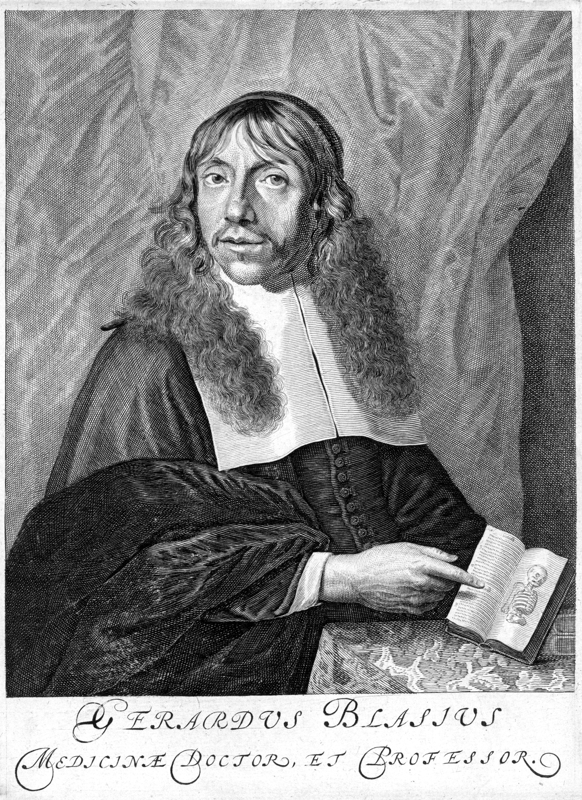

# Start

## Intro
Wat leuk dat je meedoet met deze speurtocht! In de komende paar uur zul je aan de hand van hints en foto’s zelf je tocht moeten vastleggen, door de wondere wereld van de geschiedenis van de Geneeskunde in Amsterdam!

## Uitleg
Zorg dat je telefoon is opgeladen en een werkende camera heeft. 
Houd ook pen en papier bij de hand of gebruik de notitie-app van je telefoon. 

Tijdens deze tocht zul je telkens een cryptische hint naar het volgende punt ontvangen. Heb je de hint ontcijferd en weet je waar je heen moet? Dan kun je naar de volgende pagina, waar je de vraag en (foto-)opdracht voor die locatie zult vinden. Noteer het antwoord op de vragen op papier of in je telefoon.

Ook vind je onderaan de pagina achtergrondinformatie over de locatie waar je op dat moment staat en de hint naar de volgende locatie.
N.B.: in principe zijn de vragen te beantwoorden met hints uit de omgeving, en anders met algemene kennis en een beetje creativiteit. Je hebt dus GEEN internet nodig, behalve Google Maps. Mocht je er echt niet uitkomen kan je altijd om een extra hint vragen.

## Start
Pak je fiets en ga richting het startpunt: **de Agnietenkapel**. Op 12 november 1669 begon hier de tocht naar de eerste klinische les van Gerard Blasius in Amsterdam. Vanaf hier nam hij zijn studenten mee om de theorie die ze in de Agnietenkapel leerden nu in de praktijk te zien. Zodra je bent gearriveerd, zou ik je willen vragen om je live locatie aan te zetten en aan te houden gedurende de hele tocht. 

[Klik hier als je gearriveerd bent bij locatie 1](md/locatie-1)
