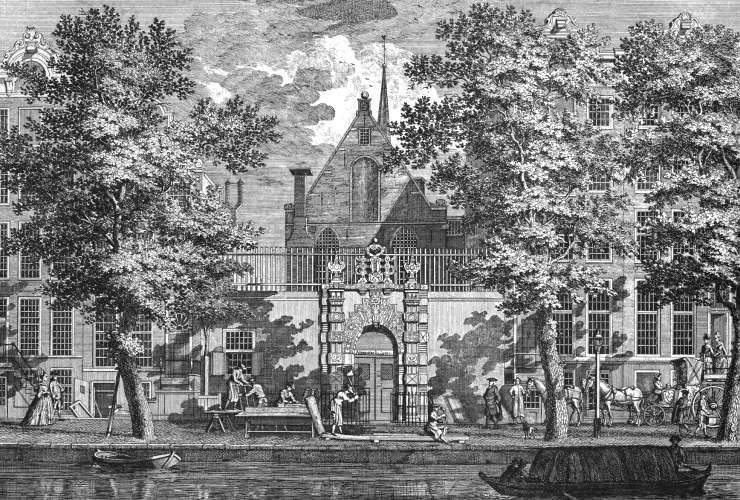

# Locatie 1: Agnietenkapel

## Vraag
<audio controls>
  <source src="https://raw.githubusercontent.com/robogast/blasius-speurtocht/master/mp3/stap1-vraag.mp3" type="audio/mpeg">
</audio>

## Hint naar locatie 2
<audio controls>
  <source src="https://raw.githubusercontent.com/robogast/blasius-speurtocht/master/mp3/stap2-hint.mp3" type="audio/mpeg">
</audio>

[Klik hier als je weet waar je heen moet voor locatie 2](locatie-2)

## Over de Agnietenkapel
Vanaf 1632 werd in de Agnietenkape een voortgezette opleiding na de Latijnse school aangeboden. Deze bereidde de jongens voor op een studie aan de universiteiten. De eerste hoogleraren van deze opleiding waren Gerard Vossius en Caspar Barleaus. Vossius doceerde kerkgeschiedenis, letteren en welsprekendheid. Barlaeus doceerde wijsbegeerte. In 1660 werd Gerard Blasius benoemd tot hoogleraar Geneeskunde en gaf in deze hoedanigheid colleges in anatomie, geneesmiddelenleer en chemie. 

In 1877 werd de onderwijsinstelling dan echt een universiteit toen het promotierecht werd verleend. Sinds 2010 vinden er weer promoties plaats in de Agnietenkapel.
