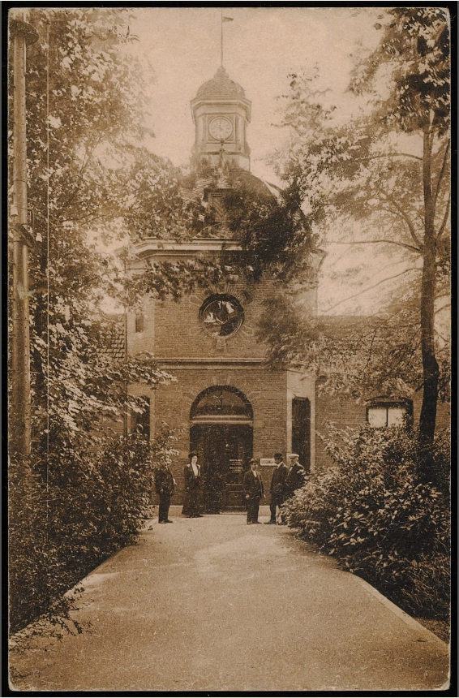

# Locatie 10: Burgerziekenhuis

## Foto-opdracht
<audio controls>
  <source src="https://raw.githubusercontent.com/robogast/blasius-speurtocht/master/mp3/stap10-foto.mp3" type="audio/mpeg">
</audio>

## Vraag
<audio controls>
  <source src="https://raw.githubusercontent.com/robogast/blasius-speurtocht/master/mp3/stap10-vraag.mp3" type="audio/mpeg">
</audio>

## Over het Burgerziekenhuis
In 1879 werd op initiatief van chirurg en gynaecoloog Anton Berns en internist Johannes Bos het Burgerziekenhuis opgericht aan de Keizersgracht. Samen met de bankier en weldoener Abraham Carel Wertheim wilden zij ervoor zorgen dat de mindervermogende 'kleine burgerstand' goede zorg konden krijgen, die zij anders niet konden betalen. Het ziekenhuis groeide steeds verder uit en twee jaar later kon het ziekenhuis verder in de nieuwbouw aan de Linneausstraat. Achter het hoofdgebouw is de rijk beplante binnentuin nog steeds toegankelijk. De afdelingen in het ziekenhuis waren gevestigd in verschillende, vrijstaande gebouwen met het idee dat zo de verspreiding van besmettelijke ziekten kon worden voorkomen. 

Het was een geliefd ziekenhuis in de buurt, maar omdat de zorgbehoefte steeds meer werd overgenomen door de andere ziekenhuizen in de stad, verhuisde het in 1981 als een polikliniek naar Almere, waar de bevolking sterk aan het groeien was. Tien jaar later hadden de medische staf en overig personeel uit het Burgerziekenhuis een nieuwe werkgever: het Flevoziekenhuis in Almere. 

## Hint naar locatie 11
<audio controls>
  <source src="https://raw.githubusercontent.com/robogast/blasius-speurtocht/master/mp3/stap11-hint.mp3" type="audio/mpeg">
</audio>

