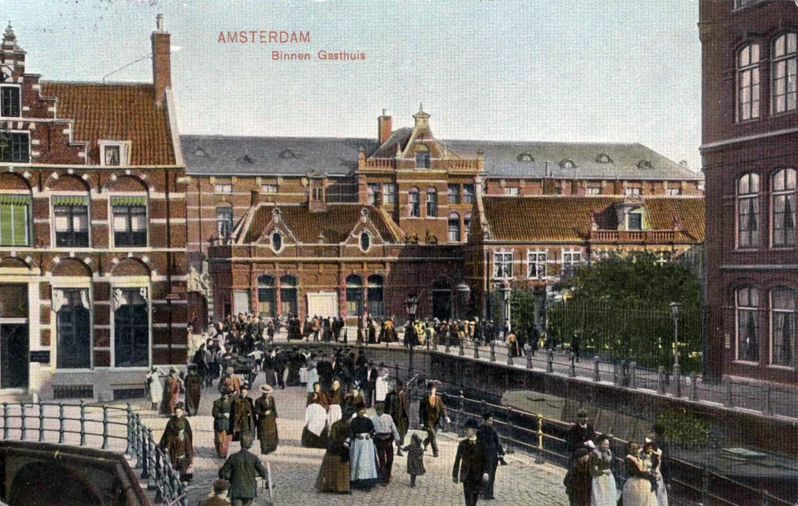

# Locatie 2: 't Gast-Huys

## Foto-opdracht
<audio controls>
  <source src="https://raw.githubusercontent.com/robogast/blasius-speurtocht/master/mp3/stap2-foto.mp3" type="audio/mpeg">
</audio>

## Vraag
<audio controls>
  <source src="https://raw.githubusercontent.com/robogast/blasius-speurtocht/master/mp3/stap2-vraag.mp3" type="audio/mpeg">
</audio>

## Over 't Gast-Huys
Het gasthuispoortje was sinds 1603 de toegangspoort van het vroegere Sint-Pietersgasthuis. Op de poort is het wapen van Amsterdam te zien met daaronder de woorden 'Gast-Huys' met aan weerszijden een zieke man en een zieke vrouw. Bezoekers van patiënten stonden vaak op de bruggen (er was toen ook nog een brug van de Oudzeijds Voorburgwal naar de overkant) te wachten tot de poort openging en het bezoekuur startte. 

Rechts van deze poort staat een gebouw met bovenop een klok en het jaartal 1875. Hier was de polikliniek Dermatologie en Geslachtsziekten gevestigd. Hier komt dan ook het spreekwoord 'onder de klok gaan' vandaan: het hebben van een geslachtsziekte. 

## Hint naar locatie 3
<audio controls>
  <source src="https://raw.githubusercontent.com/robogast/blasius-speurtocht/master/mp3/stap3-hint.mp3" type="audio/mpeg">
</audio>

[Klik hier als je weet waar je heen moet voor locatie 3](locatie-3)

