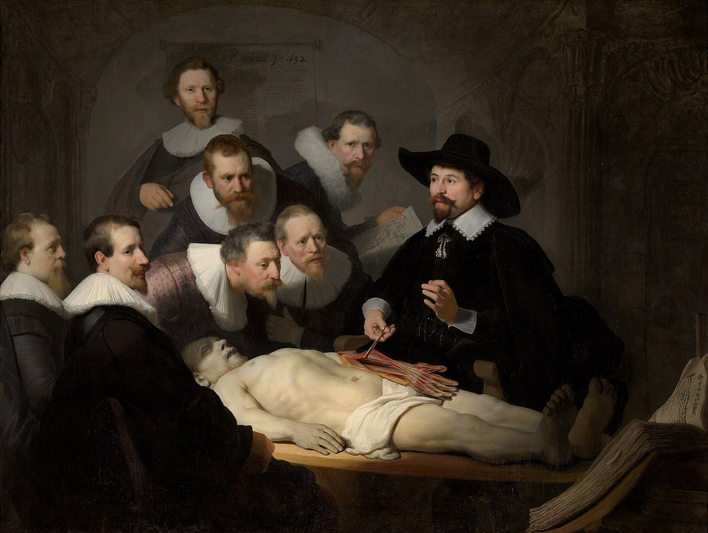
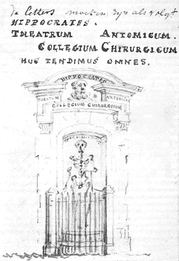

# Locatie 3: De Waag

## Foto-opdracht
<audio controls>
  <source src="https://raw.githubusercontent.com/robogast/blasius-speurtocht/master/mp3/stap3-foto.mp3" type="audio/mpeg">
</audio>

## Vraag
<audio controls>
  <source src="https://raw.githubusercontent.com/robogast/blasius-speurtocht/master/mp3/stap3-vraag.mp3" type="audio/mpeg">
</audio>

## Over De Waag
Je kunt je het bijna niet voorstellen, maar de Waag fungeerde in de Middeleeuwen nog als stadspoort en was onderdeel van de stadsmuren rondom de stad. Nadat de muur was afgebroken en verdedigingsgrachten waren gedempt, werd de poort verbouwd en kon het vanaf 1617 gebruikt worden als waaggebouw. De weegschalen stonden op de begane grond en op de bovenverdiepeing had een aantal gilden zijn kamers met een eigen toegangspoort, zo ook de chirurgijnsgilde.

De chirurgijnsgilde was verantwoordelijk voor de opleiding tot chirurgijn. Hiervoor moest men onder leiding van een meester-chirurgijn werken in een chirurgijnswinkel. Hier waren zij bezig met barbierswerkzaamheden, aderlaten, wondverzorging, het draineren van abcessen, het zetten van botbreuken en het uitvoeren van enkele spoedoperaties. Verder waren er wekelijkse theoretische lessen van de praelector anatomiae en in de wintermaanden een anatomische les in het Theatrum Anatomicum, dat zich bevindt in de koepel van De Waag. Van deze anatomische lessen zijn er negen onderwerp van een schilderij. De bekendste is 'De Anatomische les van Dr. Nicolaes Tulp', in 1632 geschilderd door Rembrandt van Rijn en tegenwoordig te zien in het Mauritshuis in Den Haag. 

## Hint naar locatie 4
<audio controls>
  <source src="https://raw.githubusercontent.com/robogast/blasius-speurtocht/master/mp3/stap4-hint.mp3" type="audio/mpeg">
</audio>

[Klik hier als je weet waar je heen moet voor locatie 4](locatie-4)

