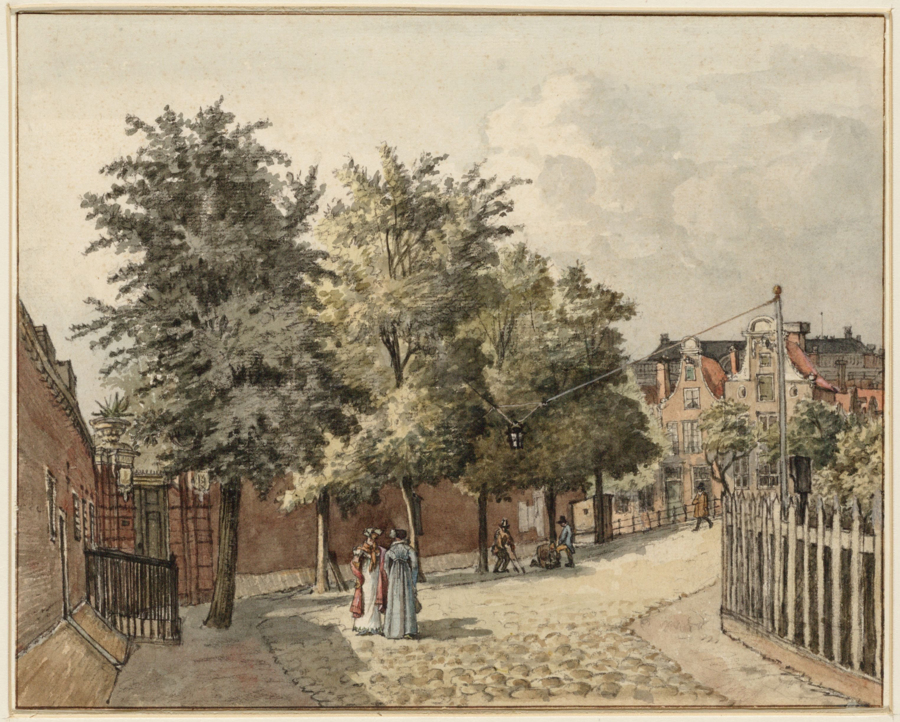

# Locatie 4: Hortus Botanicus

## Foto-opdracht
<audio controls>
  <source src="https://raw.githubusercontent.com/robogast/blasius-speurtocht/master/mp3/stap4-foto.mp3" type="audio/mpeg">
</audio>

## Vraag
<audio controls>
  <source src="https://raw.githubusercontent.com/robogast/blasius-speurtocht/master/mp3/stap4-vraag.mp3" type="audio/mpeg">
</audio>

## Over de Hortus Botanicus
Zoals op de foto te zien, heette dit vroeger de Hortus Medicus. Hier konden artsen, chirurgijns en apothekers geneeskrachtige planten en kruiden plukken voor hun patiënten. Caspar Commelin tekende in 1693 een plattegrond van de Hortus Medicus, waarop te zien is dat de tuin was verdeeld in een medische tuin en een driehoekige bloementuin. Het medische gedeelte van de tuin had ook een kas voor 'Oost- en West-Indische gewassen'. Een voorbeeld van een medicinale plant is het groot glaskruid, een zeldzame plant uit de brandnetelfamilie, die door Nicolaas Tulp werd verwekt. Hier werd een siroop van gemaakt, die werd gebruikt als darmspoeling.

## Hint naar locatie 5
<audio controls>
  <source src="https://raw.githubusercontent.com/robogast/blasius-speurtocht/master/mp3/stap5-hint.mp3" type="audio/mpeg">
</audio>

[Klik hier als je weet waar je heen moet voor locatie 5](locatie-5)

