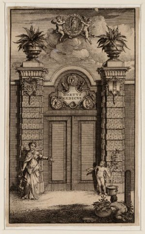

# Locatie 4: Hortus Botanicus

## Foto-opdracht
<audio controls>
  <source src="https://raw.githubusercontent.com/robogast/blasius-speurtocht/master/mp3/stap4-foto.mp3" type="audio/mpeg">
</audio>

## Vraag
<audio controls>
  <source src="https://raw.githubusercontent.com/robogast/blasius-speurtocht/master/mp3/stap4-vraag.mp3" type="audio/mpeg">
</audio>

## Hint naar locatie 5
<audio controls>
  <source src="https://raw.githubusercontent.com/robogast/blasius-speurtocht/master/mp3/stap5-hint.mp3" type="audio/mpeg">
</audio>

## Volgende locatie
[Klik hier als je weet waar je heen moet voor locatie 5](locatie-5)

