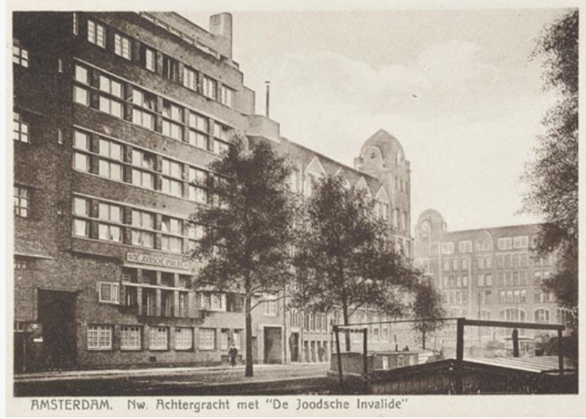
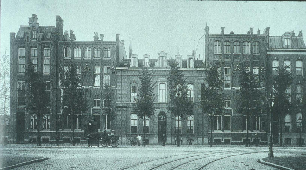

# Locatie 5: GGD Weesperstraat

## Foto-opdracht
<audio controls>
  <source src="https://raw.githubusercontent.com/robogast/blasius-speurtocht/master/mp3/stap5-foto.mp3" type="audio/mpeg">
</audio>

## Vraag
<audio controls>
  <source src="https://raw.githubusercontent.com/robogast/blasius-speurtocht/master/mp3/stap5-vraag.mp3" type="audio/mpeg">
</audio>

## Over de GGD Weesperstraat
Oorspronkelijk bevond zich hier een verpleeginstelling, maar nadat het leeg kwam te staan vestigde zich hier het Weesperplein Ziekenhuis, dat in 1976 opging in het nieuwe Slotervaart Ziekenhuis. Hierdoor kwam er ruimte vrij en kon de GGD zich hier vestigen. Het staat nu met name bekend als soa-polikliniek, maar de GGD biedt hier ook hulp aan veslaafden in het Geïntegreerde Voorzieningen Centrum.

## Hint naar locatie 6
<audio controls>
  <source src="https://raw.githubusercontent.com/robogast/blasius-speurtocht/master/mp3/stap6-hint.mp3" type="audio/mpeg">
</audio>

[Klik hier als je weet waar je heen moet voor locatie 6](locatie-6)

