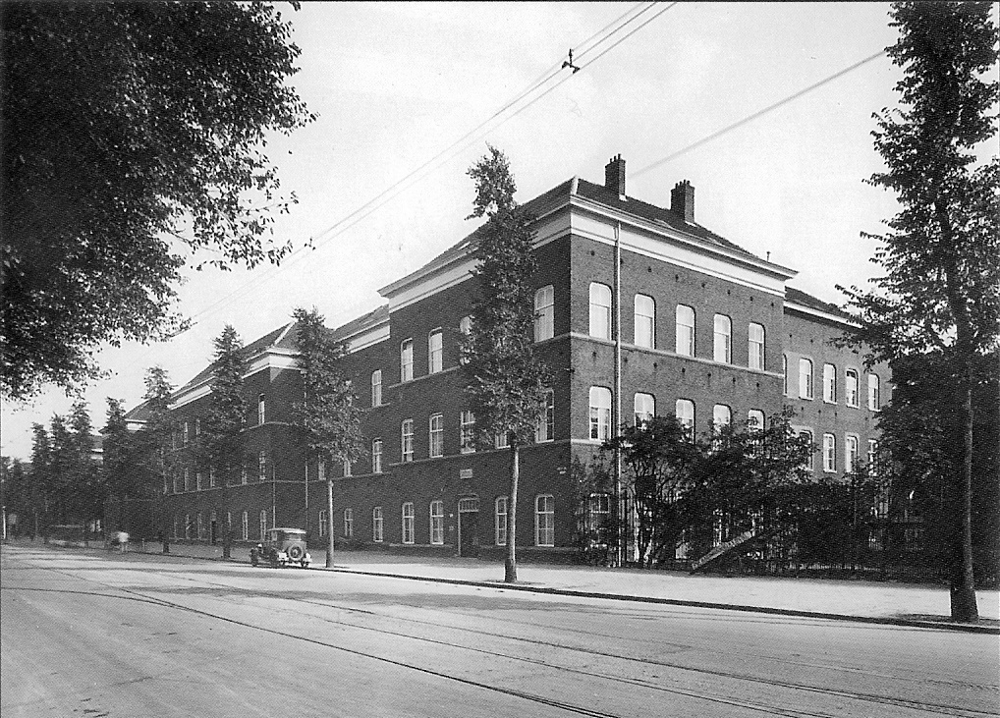
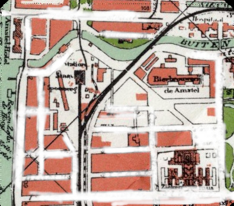

# Locatie 6: Sarphatistraat

## Foto-opdracht
<audio controls>
  <source src="https://raw.githubusercontent.com/robogast/blasius-speurtocht/master/mp3/stap6-foto.mp3" type="audio/mpeg">
</audio>

## Vraag
<audio controls>
  <source src="https://raw.githubusercontent.com/robogast/blasius-speurtocht/master/mp3/stap6-vraag.mp3" type="audio/mpeg">
</audio>

## Over de Sarphatistraat
Behalve de twee ziekenhuizen op de foto's stond aan het einde van de Spinozastraat nog een gezondheidscentrum: de Spinozakliniek. In 1874 werrd het opgericht als Inrichting voor Ooglijders, maar later kwam ook andere specialismen, zoals gynaecologie en verloskunde, interne geneeskunde en chirurgie. Voor 12,50 gulden per dag kon men hier in de eerste klasse worden verpleegd.

## Hint naar locatie 7
<audio controls>
  <source src="https://raw.githubusercontent.com/robogast/blasius-speurtocht/master/mp3/stap7-hint.mp3" type="audio/mpeg">
</audio>

[Klik hier als je weet waar je heen moet voor locatie 7](locatie-7)

