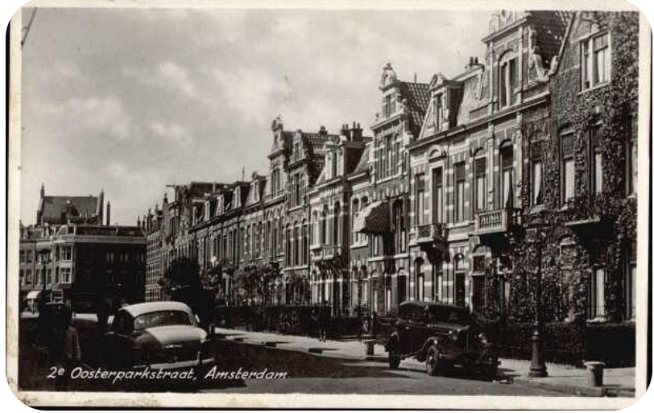

# Locatie 7: Oosterparkbuurt

## Foto-opdracht
<audio controls>
  <source src="https://raw.githubusercontent.com/robogast/blasius-speurtocht/master/mp3/stap7-foto.mp3" type="audio/mpeg">
</audio>

## Vraag
<audio controls>
  <source src="https://raw.githubusercontent.com/robogast/blasius-speurtocht/master/mp3/stap7-vraag.mp3" type="audio/mpeg">
</audio>

## Over de Oosterparkbuurt
Naast hoogleraren anatomie, zijn de straten vernoemd naar andere belangrijke figuren uit de geschiedenis van de geneeskunde. Een van deze figuren is Herman Boerhaave, hoogleraar geneeskunde en botanie en later rector magnificus van de Universiteit Leiden. Hij beschreef een syndroom waarbij een patiënt was overleden na hevig braken en ernstige pijn op de borst: het syndroom van Boerhaave. 

In deze buurt is ook een straat vernoemd naar Antoni van Leeuwenhoek, de grondlegger van de microbiologie. Van Leeuwenhoek leerde zichzelf glasblazen, glas slijpen en polijsten en was zo in staat om de eerste krachtige microscopen te maken met een vergroting tot wel 270x. Hierdoor opende zich voor hem een wereld van allerlei kleine organismen, die hij animacules noemde.

## Hint naar locatie 8
<audio controls>
  <source src="https://raw.githubusercontent.com/robogast/blasius-speurtocht/master/mp3/stap8-hint.mp3" type="audio/mpeg">
</audio>

[Klik hier als je weet waar je heen moet voor locatie 8](locatie-8)

