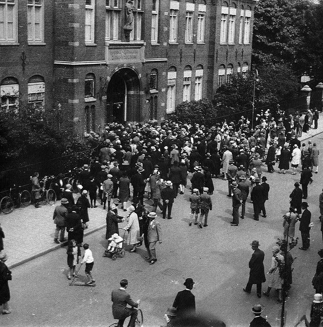

# Locatie 8: OLVG, locatie Oost

## Foto-opdracht
<audio controls>
  <source src="https://raw.githubusercontent.com/robogast/blasius-speurtocht/master/mp3/stap8-foto.mp3" type="audio/mpeg">
</audio>

## Vraag
<audio controls>
  <source src="https://raw.githubusercontent.com/robogast/blasius-speurtocht/master/mp3/stap8-vraag.mp3" type="audio/mpeg">
</audio>

## Over het OLVG, locatie Oost
De Liefdeszusters van de Heilige Carolus Borromeus stichtten in 1880 een rooms-katholieke ziekenhuisverpleging in een pand aan de Keizersgracht, waar in 1898 een nieuw ziekenhuis aan het Oosterpark bij kwam. Naast dit ziekenhuis kwam een kapel en klooster, inclusief een kleine kopie van de Lourdesgrot. Later is een groot deel van deze gebouwen afgebroken en vervangen en in 1998 werd plaats gemaakt voor de huidige nieuwbouw. Aan de gevel van het OLVG is ter hoogte van de Sparrenweg aan de gevel nog het beeld van Onze Lieve Vrouwe met Christuskind te zien, dat vroeger boven de hoofdingang van het oude hoofdgebouw in de voorgevel te zien was. Het beeld hangt op dezelfde plek als waar het hing op de oude gevel van de hoofdingang.

## Hint naar locatie 9
<audio controls>
  <source src="https://raw.githubusercontent.com/robogast/blasius-speurtocht/master/mp3/stap9-hint.mp3" type="audio/mpeg">
</audio>

[Klik hier als je weet waar je heen moet voor locatie 9](locatie-9)

