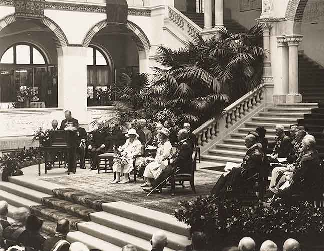
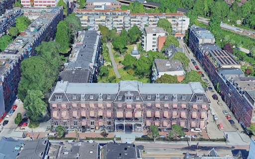

# Locatie 9: Laboratoria in het Oosterpark

## Foto-opdracht
<audio controls>
  <source src="https://raw.githubusercontent.com/robogast/blasius-speurtocht/master/mp3/stap9-foto.mp3" type="audio/mpeg">
</audio>

## Vraag
<audio controls>
  <source src="https://raw.githubusercontent.com/robogast/blasius-speurtocht/master/mp3/stap9-vraag.mp3" type="audio/mpeg">
</audio>

## Over de laboratoria in het Oosterpark
Een groot deel van de gebouwen aan de noordelijke zijde van het Oosterpark waren ooit in het bezit van de Universiteit van Amsterdam. Onder andere de afdeling Anatomie was hier ooit gevestigd. De toenmalige hoogleraar anatomie, Louis Bolk, trok in 1909 in een gebouw ontworpen volgens zijn inzichten door de architect J.B. Springer. In het gebouw stond een borstbeeld van Nicolaes Tulp, de eerste hoogleraar anatomie in Amsterdam, en aan de muren hingen twee marmeren plaquettes: één ter herdenking van de opening in 1909 en de ander met de namen van achtereenvolgende hoogleraren anatomie van 1629 tot 1984, toen de afdeling anatomie naar het AMC verhuisde. De oplettende student in het AMC heeft deze plaquettes wel zien hangen bij collegezaal 2. 

## Hint naar locatie 10
<audio controls>
  <source src="https://raw.githubusercontent.com/robogast/blasius-speurtocht/master/mp3/stap10-hint.mp3" type="audio/mpeg">
</audio>

[Klik hier als je weet waar je heen moet voor locatie 10](locatie-10)

